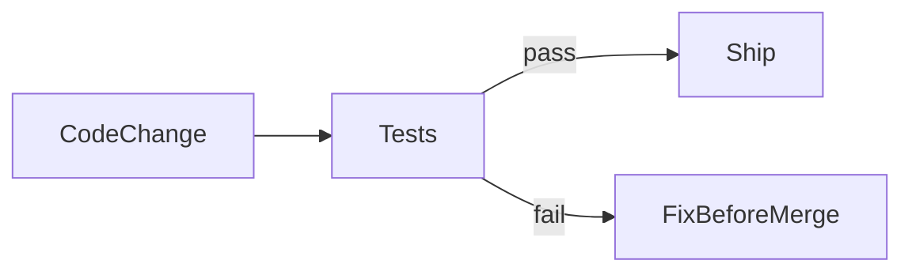

# Lesson 1: Introduction to Testing (Long-form Enhanced)

> Testing is your safety net for change. This lesson is long-form so it can serve as a reference: what testing is, what kinds of tests exist, how the “testing pyramid” trade-offs work, and how AAA keeps tests readable.

## Table of Contents

- What testing is (and why it matters in production)
- The testing pyramid (trade-offs: speed vs confidence)
- Test types: unit vs integration vs E2E
- AAA (Arrange–Act–Assert) and a first example
- Best practices, pitfalls, troubleshooting
- Advanced patterns (preview): flakiness, boundaries, CI mindset

## Learning Objectives

By the end of this lesson, you will be able to:
- Explain what software testing is and why it matters in production systems
- Understand the testing pyramid and common trade-offs (speed, confidence, cost)
- Identify unit vs integration vs end-to-end tests
- Read and write a basic test using Arrange–Act–Assert
- Recognize common misconceptions (tests are “only for QA”, 100% coverage = quality)

## Why Testing Matters

Testing verifies that your code works as expected and helps prevent regressions.

In real systems, testing supports:
- confident refactoring
- safer releases
- easier collaboration (tests become living documentation)



## Why Test?

- **Catch bugs early**: find issues before production
- **Documentation**: tests show how code is intended to behave
- **Refactoring confidence**: change code safely with a safety net
- **Regression prevention**: new changes don’t break existing behavior

## Testing Pyramid (Mental Model)

The testing pyramid is a guideline for balancing:
- confidence
- speed
- maintenance cost

```text
        /\
       /  \
      / E2E \        Few, slow, expensive
     /--------\
    /          \
   / Integration \   Some, medium speed
  /--------------\
 /                \
/   Unit Tests      \  Many, fast, cheap
/--------------------\
```

### Why this shape works (usually)

- unit tests are fast and pinpoint failures
- integration tests catch “components working together” issues
- e2e tests catch real workflows but are slower and more brittle

There are valid exceptions (e.g., UI-heavy apps), but the trade-offs remain.

## Types of Tests

### Unit tests

Test individual functions/modules in isolation.

Examples:
- parsing query params
- validating input
- computing totals

### Integration tests

Test parts working together.

Examples:
- API route + database
- service layer + repository

### End-to-end (E2E) tests

Test complete user workflows through the UI and backend.

Examples:
- user signs up → logs in → creates a post

## A Basic Test Structure (AAA)

```typescript
describe("Feature Name", () => {
  it("should do something", () => {
    // Arrange
    const input = "test";

    // Act
    const result = functionToTest(input);

    // Assert
    expect(result).toBe("expected");
  });
});
```

## Advanced Patterns (Preview)

### 1) Flaky tests are a systems problem

Flakiness usually comes from:
- time (timers, sleeps, race conditions)
- shared state (DB, cache, files)
- environment differences (CI vs local)

The fix is typically better isolation and deterministic setup—not “rerun until green”.

### 2) Test boundaries, not implementation details

Prefer asserting user-visible behavior and stable outputs over private internal calls.
This keeps tests resilient during refactors.

### 3) CI mindset (fast feedback)

In real teams, tests are part of the merge contract:
- quick unit tests on every commit
- broader integration/e2e coverage with reasonable runtime

## Real-World Scenario: Preventing a Regression

Imagine a teammate changes a function “to optimize it” and accidentally breaks edge cases.
A good unit test suite catches that before merge and saves production from an incident.

## Best Practices

### 1) Test behavior, not implementation

Prefer “what should happen” over “how it happens”, especially for refactors.

### 2) Keep tests fast and reliable

If tests are flaky or slow, developers stop trusting them.

### 3) Use the right level of test for the job

Use unit tests for logic, integration tests for boundaries, and E2E for key flows.

## Common Pitfalls and Solutions

### Pitfall 1: Testing only happy paths

**Problem:** real users hit edge cases.

**Solution:** add tests for invalid input, not-found cases, and error handling.

### Pitfall 2: Treating 100% coverage as the goal

**Problem:** you write meaningless tests to satisfy a metric.

**Solution:** prioritize critical paths and meaningful assertions.

### Pitfall 3: Flaky tests

**Problem:** tests fail randomly and waste time.

**Solution:** remove timing dependencies, mock unstable dependencies, isolate state.

## Troubleshooting

### Issue: Tests pass locally but fail in CI

**Symptoms:**
- “works on my machine” test failures

**Solutions:**
1. Ensure Node/pnpm versions match CI.
2. Ensure lockfile is committed and installs are frozen.
3. Avoid reliance on local machine state (ports, timezones, env vars).

## Next Steps

Now that you understand the purpose of testing:

1. ✅ **Practice**: Write 3 unit tests for a pure function
2. ✅ **Experiment**: Add one integration test for an API endpoint
3. 📖 **Next Lesson**: Learn about [Testing Concepts](./lesson-02-testing-concepts.md)
4. 💻 **Complete Exercises**: Work through [Exercises 01](./exercises-01.md)

## Additional Resources

- [Testing Library: Guiding principles](https://testing-library.com/docs/guiding-principles/)
- [Google Testing Blog](https://testing.googleblog.com/)

---

**Key Takeaways:**
- Testing is a safety net that enables faster, safer development.
- Use a mix of unit, integration, and E2E tests with clear trade-offs.
- Prioritize reliability and meaningful coverage over vanity metrics.
