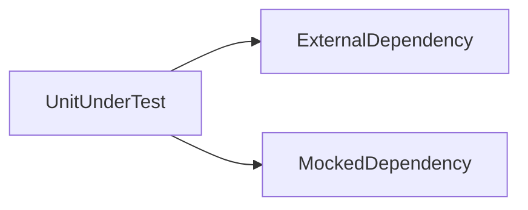

# Lesson 3: Mocking (Long-form Enhanced)

> Mocking is how you keep unit tests fast and deterministic by replacing slow/flaky dependencies. This lesson focuses on mocking *at boundaries* (network, filesystem, time) without over-mocking your own logic.

## Table of Contents

- Why mocking exists (and when not to mock)
- `jest.fn()` basics (calls, return values, implementations)
- Module mocking and `jest.spyOn`
- Mocking async dependencies reliably
- Best practices, pitfalls, troubleshooting
- Advanced patterns (preview): fake timers, dependency injection, contract tests

## Learning Objectives

By the end of this lesson, you will be able to:
- Use `jest.fn()` to create mocks and assert calls
- Mock return values and implementations
- Mock modules and spy on functions with `jest.spyOn`
- Mock async dependencies reliably (`mockResolvedValue`, `mockRejectedValue`)
- Avoid common pitfalls (over-mocking, mocking the unit under test, leaky mocks between tests)

## Why Mocking Matters

Mocking lets you test behavior in isolation when the real dependency is:
- slow (database, network)
- flaky (external APIs)
- expensive (third-party services)
- hard to control (time, randomness)

The goal is not “mock everything”.
The goal is “mock at boundaries so tests stay fast, deterministic, and meaningful”.



## Jest Mock Functions (`jest.fn`)

### Mock a function and assert calls

```typescript
const mockFn = jest.fn();
mockFn("arg");
expect(mockFn).toHaveBeenCalledWith("arg");
```

### Mock return value

```typescript
const mockFn = jest.fn().mockReturnValue(42);
expect(mockFn()).toBe(42);
```

### Mock implementation

```typescript
const mockFn = jest.fn().mockImplementation((x: number) => x * 2);
expect(mockFn(5)).toBe(10);
```

## Mocking Modules

### Mock an entire module

```typescript
jest.mock("./api", () => ({
  fetchData: jest.fn().mockResolvedValue({ data: "test" }),
}));
```

This is useful when:
- your unit imports `fetchData` and you want to control its behavior
- you want to avoid real network calls

### Spy on a specific function

`jest.spyOn` is often preferable when you want:
- to keep the module real
- but override one function temporarily

```typescript
jest.spyOn(module, "functionName").mockReturnValue("mocked");
```

## Mocking Async Functions

For async dependencies:

```typescript
const mockFetch = jest.fn().mockResolvedValue({
  json: async () => ({ data: "test" }),
});

global.fetch = mockFetch as any;
```

### Mocking errors

```typescript
const mockFn = jest.fn().mockRejectedValue(new Error("Network error"));
await expect(mockFn()).rejects.toThrow("Network error");
```

## Real-World Scenario: Testing a Service That Calls an API

If `UserService` calls an external billing API, unit tests should:
- mock the API client
- assert that your service handles success/failure correctly

Integration tests can cover “real” API calls in a controlled environment (or against a sandbox).

## Best Practices

### 1) Mock at boundaries, not internally

Mock external I/O (HTTP, DB), not pure functions you own.

### 2) Reset mocks between tests

Avoid cross-test pollution:
- `jest.clearAllMocks()` or `mockFn.mockClear()`

### 3) Prefer spies when you want partial real behavior

Spies can reduce the risk of mocking too much and missing real behavior.

## Common Pitfalls and Solutions

### Pitfall 1: Over-mocking

**Problem:** tests pass, but real integration fails.

**Solution:** keep unit tests focused, and add integration tests for critical boundaries.

### Pitfall 2: Mock leakage between tests

**Problem:** one test’s mock affects another test.

**Solution:** clear/reset mocks in `beforeEach`.

### Pitfall 3: Mocking the unit under test

**Problem:** you mock the function you're supposed to verify.

**Solution:** only mock dependencies; test the real unit.

## Troubleshooting

### Issue: Test passes but shouldn’t (false positive)

**Symptoms:**
- assertions are too weak or missing

**Solutions:**
1. Assert calls and outputs precisely.
2. Assert error cases (`mockRejectedValue`) and verify behavior.

### Issue: Tests fail only when run together

**Symptoms:**
- order-dependent failures

**Solutions:**
1. Reset mocks and shared state in `beforeEach`.
2. Avoid global mutation (like `global.fetch`) without cleanup.

## Advanced Patterns (Preview)

### 1) Fake timers (time control)

If code uses timeouts/intervals, fake timers make tests deterministic and faster.

### 2) Dependency injection (make mocking easier)

When your units take dependencies as parameters (instead of importing globals everywhere), tests can swap implementations cleanly.

### 3) Contract-style tests at boundaries

Mocks can drift from reality. Integration tests (or contract tests) help ensure your “fake” dependency behaves like the real one.

## Next Steps

Now that you can mock dependencies:

1. ✅ **Practice**: Mock a DB repository and test a service layer
2. ✅ **Experiment**: Replace a full module mock with a `spyOn` and compare clarity
3. 📖 **Next Level**: Move into frontend/backend/integration testing
4. 💻 **Complete Exercises**: Work through [Exercises 02](./exercises-02.md)

## Additional Resources

- [Jest Docs: Mock Functions](https://jestjs.io/docs/mock-functions)
- [Jest Docs: Mocking Modules](https://jestjs.io/docs/mock-functions#mocking-modules)

---

**Key Takeaways:**
- Use mocks to isolate external dependencies and keep unit tests fast and deterministic.
- Use `mockResolvedValue`/`mockRejectedValue` for async behavior.
- Avoid over-mocking and reset mocks between tests to prevent leakage.
