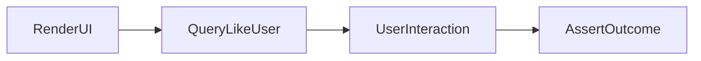

# Lesson 1: React Testing Library (Long-form Enhanced)

> React Testing Library (RTL) helps you test UI the way users experience it. This lesson focuses on accessible queries, interaction testing, and avoiding brittle selectors that break on refactor.

## Table of Contents

- RTL philosophy (“test like a user”)
- Rendering + asserting with `screen`
- Query priority (`getByRole` first)
- Interactions + outcomes
- Best practices, pitfalls, troubleshooting
- Advanced patterns (preview): async UI, MSW, testing forms/accessibility

## Learning Objectives

By the end of this lesson, you will be able to:
- Explain the core philosophy of React Testing Library (test like a user)
- Render a component and assert on user-visible output using `screen`
- Choose the right query (`getByRole`, `getByLabelText`, etc.) for accessibility
- Simulate interactions and assert outcomes
- Avoid common pitfalls (testing implementation details, overusing `testid`, brittle selectors)

## Why React Testing Library Matters

React Testing Library (RTL) helps you write tests that:
- resemble how users interact with your UI
- encourage accessible components (roles/labels)
- survive refactors (less coupled to internals)



## Setup (Minimal Example)

```typescript
import { render, screen } from "@testing-library/react";
import "@testing-library/jest-dom";

import Button from "./Button";

test("renders button", () => {
  render(<Button label="Click me" />);
  expect(screen.getByText("Click me")).toBeInTheDocument();
});
```

### What `@testing-library/jest-dom` adds

It provides helpful matchers like:
- `toBeInTheDocument`
- `toHaveTextContent`
- `toHaveValue`

These make UI assertions clearer.

## Queries (How to Find Elements)

RTL queries encourage accessibility-first patterns.

```typescript
// By text (visible content)
screen.getByText("Hello");

// By role (preferred for buttons/inputs/links)
screen.getByRole("button", { name: "Save" });

// By label (form fields)
screen.getByLabelText("Email");

// By test id (last resort)
screen.getByTestId("submit-button");
```

### Query priority (rule of thumb)

Prefer:
1. `getByRole` with accessible name
2. `getByLabelText`
3. `getByText`
4. `getByTestId` (only when necessary)

This makes tests closer to real UX and less brittle.

## User Interactions

You can simulate events (click, change, submit) and assert the result:

```typescript
import { render, screen, fireEvent } from "@testing-library/react";

test("handles click", () => {
  const handleClick = jest.fn();
  render(<Button onClick={handleClick} />);

  fireEvent.click(screen.getByRole("button"));

  expect(handleClick).toHaveBeenCalled();
});
```

### A note on `fireEvent`

`fireEvent` is fine for many cases, but for more realistic interactions (typing, tabbing),
`@testing-library/user-event` is often preferable (covered in practice/exercises).

## Real-World Scenario: Preventing UI Regressions

If a refactor changes internal component structure, tests that query by role/label still pass as long as the user-facing behavior remains correct.
This is exactly what you want.

## Best Practices

### 1) Test the behavior users care about

Focus on what the user sees and can do.

### 2) Make components accessible

Using roles and labels makes both your UI and your tests better.

### 3) Keep assertions specific

Assert on meaningful outcomes (text changes, disabled state, navigation) rather than generic “renders”.

## Common Pitfalls and Solutions

### Pitfall 1: Testing implementation details

**Problem:** tests break on refactor (DOM structure changes) even though behavior is correct.

**Solution:** query by role/label/text and assert behavior.

### Pitfall 2: Overusing `data-testid`

**Problem:** tests become tied to internal identifiers.

**Solution:** reserve `testid` for cases where no accessible query is possible.

### Pitfall 3: Not accounting for async UI updates

**Problem:** tests fail because state updates happen after a promise resolves.

**Solution:** use async patterns (`findBy*`, `waitFor`) when the UI updates asynchronously.

## Troubleshooting

### Issue: `getByRole` can’t find an element

**Symptoms:**
- “Unable to find an accessible element with the role…”

**Solutions:**
1. Ensure the element is actually rendered.
2. Ensure it has an accessible name (label text, `aria-label`, button text).
3. Use `screen.debug()` locally (in practice) to inspect the rendered output.

## Advanced Patterns (Preview)

### 1) Async UI patterns

For UI that updates after promises/effects, prefer:
- `findBy*` queries
- `waitFor` for state transitions

### 2) MSW (Mock Service Worker) (concept)

MSW mocks the network boundary so your UI tests can behave like real fetches without brittle manual mocks.

### 3) Accessibility-first tests scale better

Using roles/labels makes tests more resilient and often surfaces real UX issues (missing labels, confusing names).

## Next Steps

Now that you can use RTL basics:

1. ✅ **Practice**: Write a test using `getByRole` and assert button state changes
2. ✅ **Experiment**: Replace a `testid` query with `getByRole`/`getByLabelText`
3. 📖 **Next Lesson**: Learn about [Component Testing](./lesson-02-component-testing.md)
4. 💻 **Complete Exercises**: Work through [Exercises 03](./exercises-03.md)

## Additional Resources

- [Testing Library: Queries](https://testing-library.com/docs/queries/about/)
- [Jest DOM matchers](https://github.com/testing-library/jest-dom)

---

**Key Takeaways:**
- RTL encourages testing UI the way users interact with it.
- Prefer accessible queries (`getByRole`, `getByLabelText`) over `data-testid`.
- Assert meaningful outcomes and use async waits when the UI updates asynchronously.
