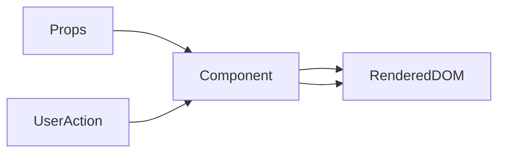

# Lesson 2: Component Testing (Long-form Enhanced)

> Component tests are the “sweet spot” for UI confidence: they’re faster than E2E, but still validate user-visible behavior and regressions in interaction flows.

## Table of Contents

- Render + assert (user-visible output)
- Props-driven updates (`rerender`)
- Events and interactions (click/change/submit)
- Avoiding brittle selectors (roles/labels first)
- Best practices, pitfalls, troubleshooting
- Advanced patterns (preview): async UI, MSW, testing forms/accessibility

## Learning Objectives

By the end of this lesson, you will be able to:
- Write component tests that assert user-visible output and behavior
- Test props-driven rendering and updates (`rerender`)
- Test events (click, input) and verify state/UI changes
- Decide what *not* to test (implementation details, CSS specifics)
- Avoid common pitfalls (brittle selectors, missing accessibility labels, shallow assertions)

## Why Component Testing Matters

Component tests validate:
- UI rendering given props/state
- interaction behavior (forms, buttons, toggles)
- conditional UI (loading/error/empty states)

They are faster than E2E tests and provide strong confidence in UI correctness.



## Testing Components (Render + Assert)

```typescript
import { render, screen } from "@testing-library/react";
import UserCard from "./UserCard";

test("displays user information", () => {
  const user = { name: "Alice", email: "alice@example.com" };
  render(<UserCard user={user} />);

  expect(screen.getByText("Alice")).toBeInTheDocument();
  expect(screen.getByText("alice@example.com")).toBeInTheDocument();
});
```

### Improve robustness with role-based assertions

When possible, prefer `getByRole` with accessible names over raw text queries.

## Testing Props (Rerender)

`rerender` helps test “same component, new props”.

```typescript
import { render, screen } from "@testing-library/react";
import Counter from "./Counter";

test("handles different props", () => {
  const { rerender } = render(<Counter initial={0} />);
  expect(screen.getByText("0")).toBeInTheDocument();

  rerender(<Counter initial={5} />);
  expect(screen.getByText("5")).toBeInTheDocument();
});
```

### What you’re asserting

You’re testing that the component responds correctly to new props (a common source of UI bugs).

## Testing Events (Input Change)

```typescript
import { render, screen, fireEvent } from "@testing-library/react";
import InputField from "./InputField";

test("updates on input change", () => {
  render(<InputField />);
  const input = screen.getByLabelText("Name");

  fireEvent.change(input, { target: { value: "Alice" } });
  expect(input).toHaveValue("Alice");
});
```

### Accessibility note

If `getByLabelText("Name")` fails, it often means your input is missing a proper `<label>` association.
That’s a UI bug worth fixing.

## Real-World Scenario: Form Regression

A common UI regression:
- validation message appears in the wrong condition
- submit button remains enabled when it shouldn’t

Component tests can cover:
- button disabled/enabled state
- error messages
- “loading” states during submit

## Best Practices

### 1) Test what users can observe

Text, roles, button state, error messages, navigation triggers.

### 2) Cover the three key states

- loading
- error
- success/empty

### 3) Keep tests readable

AAA structure and descriptive test names reduce maintenance cost.

## Common Pitfalls and Solutions

### Pitfall 1: Tests coupled to DOM structure

**Problem:** tests break when you rearrange markup.

**Solution:** query by role/label/text instead of deep CSS selectors.

### Pitfall 2: Only testing “renders”

**Problem:** you don’t test behavior; regressions slip through.

**Solution:** simulate user interactions and assert outcomes.

### Pitfall 3: Missing async handling

**Problem:** tests fail when UI updates after promises.

**Solution:** use async patterns (`findBy*`, `waitFor`) for async UI updates.

## Troubleshooting

### Issue: Tests fail due to missing labels/roles

**Symptoms:**
- queries like `getByLabelText` fail

**Solutions:**
1. Fix component accessibility (labels, roles, accessible names).
2. Prefer role-based queries for interactive elements.

## Advanced Patterns (Preview)

### 1) Async UI patterns

If UI updates after a promise resolves, prefer:
- `findBy*` queries (waits for element)
- `waitFor` for state transitions

### 2) Mock Service Worker (MSW) (concept)

MSW can mock network requests at the boundary so your tests behave like real fetches without brittle manual mocks.

### 3) Forms + accessibility as a test driver

When you test with `getByRole` and `getByLabelText`, missing labels/roles becomes visible—often revealing real UX bugs.

## Next Steps

Now that you can test components:

1. ✅ **Practice**: Test a component with loading/error/success states
2. ✅ **Experiment**: Replace text queries with role-based queries for robustness
3. 📖 **Next Lesson**: Learn about [Hook Testing](./lesson-03-hook-testing.md)
4. 💻 **Complete Exercises**: Work through [Exercises 03](./exercises-03.md)

## Additional Resources

- [Testing Library: About queries](https://testing-library.com/docs/queries/about/)

---

**Key Takeaways:**
- Component tests should assert user-visible behavior and state changes.
- Use `rerender` to verify props updates.
- Prefer accessible queries; failures often indicate accessibility issues.
