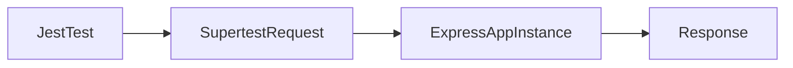

# Lesson 2: Supertest (Long-form Enhanced)

> Supertest is the practical tool that makes HTTP-level testing fast and CI-friendly. This lesson focuses on testing the Express app instance, asserting stable behavior, and avoiding common hang/flakiness traps.

## Table of Contents

- Why Supertest (test at HTTP layer without real ports)
- Request methods, params, and bodies
- Headers and auth patterns
- Stable assertions (shape over exact data)
- Best practices, pitfalls, troubleshooting
- Advanced patterns (preview): app factory, per-test setup, request helpers

## Learning Objectives

By the end of this lesson, you will be able to:
- Use Supertest to make HTTP requests against an Express app in tests
- Assert on status codes, headers, and JSON bodies
- Send request bodies and query params reliably
- Set headers for auth and content types
- Avoid common pitfalls (starting a real server, not awaiting requests, brittle body assertions)

## Why Supertest Matters

Supertest lets you test your Express app at the HTTP layer without needing:
- a deployed environment
- a real port binding (in most setups)

This makes API tests fast and CI-friendly.



## Basic Usage

```typescript
import request from "supertest";
import app from "./app";

describe("API Tests", () => {
  test("health check", async () => {
    const response = await request(app).get("/health").expect(200);

    expect(response.body).toEqual({ status: "ok" });
  });
});
```

### Key idea: test the app instance

Most projects export the Express app without calling `listen()` in tests.
This avoids port conflicts and speeds up tests.

## Request Methods

```typescript
// GET
await request(app).get("/users");

// POST
await request(app).post("/users").send({ name: "Alice" });

// PUT
await request(app).put("/users/1").send({ name: "Alice Updated" });

// DELETE
await request(app).delete("/users/1");
```

### Query params

```typescript
await request(app).get("/users").query({ page: 1, limit: 20 });
```

## Headers and Auth

```typescript
await request(app)
  .get("/protected")
  .set("Authorization", "Bearer token")
  .set("Content-Type", "application/json")
  .expect(200);
```

### Asserting content type

```typescript
await request(app)
  .get("/health")
  .expect("Content-Type", /json/);
```

## Real-World Scenario: Testing “Error Shape” Consistency

If your API promises a consistent error response body, Supertest tests can enforce it:
- 400 returns `{ success: false, error: "...", details?: ... }`
- 401 returns `{ success: false, error: "Authentication required" }`

This prevents frontend breakage.

## Best Practices

### 1) Always `await` requests

Requests are async. Not awaiting can create false positives and flaky tests.

### 2) Keep assertions stable

Prefer:
- “has property X”
- “matches shape”
over exact deep equality when values are dynamic (IDs, timestamps).

### 3) Reset state between tests

If requests hit a DB, ensure you:
- use a test DB
- clean it between tests

## Common Pitfalls and Solutions

### Pitfall 1: Starting a real server in tests

**Problem:** port conflicts and slow tests.

**Solution:** export the Express app and use Supertest against it directly.

### Pitfall 2: Flaky response body assertions

**Problem:** deep equality fails due to dynamic fields.

**Solution:** assert on stable fields and shapes.

### Pitfall 3: Missing JSON parsing middleware

**Problem:** POST body becomes `undefined`.

**Solution:** ensure `express.json()` is enabled in the app setup.

## Troubleshooting

### Issue: Requests hang

**Symptoms:**
- test never finishes

**Solutions:**
1. Ensure handlers always send a response (no missing `return`).
2. Ensure async errors are handled (middleware).
3. Add timeouts/logging to locate the stuck route.

## Advanced Patterns (Preview)

### 1) App factory pattern

In larger apps, create an `createApp()` function so tests can build an isolated app instance with test-only configuration.

### 2) Request helpers

Create small helpers like `loginAsUser()` or `requestWithAuth(token)` so tests stay readable and consistent.

### 3) Deterministic setup per test

Keep each test independent:
- seed only the data you need
- reset state between tests
- avoid order dependencies

## Next Steps

Now that you can use Supertest effectively:

1. ✅ **Practice**: Add tests for POST/PUT/DELETE endpoints
2. ✅ **Experiment**: Add query param tests for pagination and filtering
3. 📖 **Next Lesson**: Learn about [Database Testing](./lesson-03-database-testing.md)
4. 💻 **Complete Exercises**: Work through [Exercises 04](./exercises-04.md)

## Additional Resources

- [Supertest](https://github.com/ladjs/supertest)

---

**Key Takeaways:**
- Supertest tests Express at the HTTP layer without needing real port binding.
- Assert on status, headers, and stable response shapes.
- Always await requests and keep tests deterministic with clean state.
