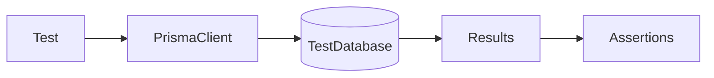

# Lesson 3: Database Testing (Long-form Enhanced)

> Database tests catch the bugs mocks miss: constraints, relations, migrations, and real query behavior. This lesson focuses on using a dedicated test DB, resetting state deterministically, and keeping DB tests fast enough to run in CI.

## Table of Contents

- When to test with a real DB (vs mocks)
- Dedicated test DB setup (safety first)
- Reset strategies (delete order, truncation concept)
- Making DB tests deterministic
- Best practices, pitfalls, troubleshooting
- Advanced patterns (preview): transaction rollbacks, test containers, migration testing

## Learning Objectives

By the end of this lesson, you will be able to:
- Set up a dedicated database environment for tests
- Reset database state between tests safely and deterministically
- Write tests that validate real DB behavior (constraints, relations, queries)
- Understand trade-offs: real DB tests vs mocked repositories
- Avoid common pitfalls (running tests against dev/prod DB, slow/flaky cleanup, shared state)

## Why Database Testing Matters

Many real bugs only show up when the database is involved:
- unique constraints
- foreign keys
- migrations
- relation queries

If you only mock the database, you can miss these failures until production.



## Test Database Setup (Prisma)

Use a dedicated test DB URL:

```typescript
import { PrismaClient } from "@prisma/client";

const prisma = new PrismaClient({
  datasources: {
    db: {
      url: process.env.TEST_DATABASE_URL,
    },
  },
});

beforeEach(async () => {
  // Clean database
  await prisma.user.deleteMany();
});

afterAll(async () => {
  await prisma.$disconnect();
});
```

### Important safety rule

Never run tests against:
- development DB by accident
- production DB ever

Use separate credentials and environment variables.

## Testing with a Real Database

```typescript
test("creates user in database", async () => {
  const user = await prisma.user.create({
    data: { email: "test@example.com", name: "Test" },
  });

  expect(user).toHaveProperty("id");
  expect(user.email).toBe("test@example.com");
});
```

### What to test with a real DB

High-value DB tests include:
- uniqueness constraints (`email` unique)
- relations (user → posts)
- migrations applied correctly
- transaction behavior (advanced)

## Cleaning Strategies (Trade-offs)

Common approaches:
- `deleteMany()` for relevant tables (fast to implement, can be slow at scale)
- truncate/reset scripts (faster but more DB-specific)
- recreate schema per test run (slow but clean, common in CI)

Choose the simplest approach that stays deterministic and fast enough.

## Mocking the Database (When It Makes Sense)

Sometimes you want to test service logic without a real DB:
- pure business rules
- edge-case behavior
- error handling for repository failures

Example (concept):

```typescript
jest.mock("@prisma/client", () => ({
  PrismaClient: jest.fn().mockImplementation(() => ({
    user: {
      create: jest.fn().mockResolvedValue({ id: 1, email: "test@example.com" }),
    },
  })),
}));
```

### Warning about DB mocks

Mocking Prisma can be brittle and can hide real DB behavior.
A common alternative is to:
- mock your own repository layer interfaces
- keep a smaller set of real DB integration tests

## Real-World Scenario: “Unique Email” Bug

If your code forgets to handle duplicate emails:
- unit tests might pass
- real DB tests will fail with constraint errors

Database tests force you to implement correct 409/conflict handling.

## Best Practices

### 1) Use a dedicated test DB

Separate credentials and environment variables per environment.

### 2) Reset state deterministically

Tests should not depend on order or leftover rows.

### 3) Keep DB tests focused

Test the behavior that truly needs a DB; keep most logic unit-tested.

## Common Pitfalls and Solutions

### Pitfall 1: Slow test suites

**Problem:** DB setup/cleanup dominates runtime.

**Solution:** reduce DB tests to high-value cases and optimize cleanup strategy.

### Pitfall 2: Flaky cleanup

**Problem:** foreign key constraints prevent deletes in the wrong order.

**Solution:** delete children before parents, or use truncation strategies.

### Pitfall 3: Using the wrong environment variables in CI

**Problem:** tests connect to the wrong DB.

**Solution:** enforce TEST_DATABASE_URL in CI and add guards (fail fast if missing).

## Troubleshooting

### Issue: Tests fail with foreign key constraint errors during cleanup

**Symptoms:**
- deleteMany throws due to FK constraints

**Solutions:**
1. Delete in correct order (children before parents).
2. Consider truncation/reset strategies.

### Issue: Prisma Client doesn’t disconnect and Jest hangs

**Symptoms:**
- Jest process doesn’t exit

**Solutions:**
1. Ensure `prisma.$disconnect()` runs in `afterAll`.
2. Ensure you don’t create multiple PrismaClients per test.

## Advanced Patterns (Preview)

### 1) Transaction rollback per test (concept)

Some setups wrap each test in a transaction and roll it back afterward. This can be very fast, but requires careful handling of connection scope.

### 2) Test containers (concept)

Running Postgres in an isolated container per test suite (or per CI job) increases isolation and reduces “works on my machine” drift.

### 3) Migration testing

Treat migrations as part of your system:
- apply migrations in CI before running integration tests
- validate that the schema in a fresh DB matches expectations

## Next Steps

Now that you can test database behavior:

1. ✅ **Practice**: Add a unique constraint test and assert API returns 409
2. ✅ **Experiment**: Add relation tests (user with posts) and verify cleanup order
3. 📖 **Next Level**: Move into integration testing across services
4. 💻 **Complete Exercises**: Work through [Exercises 04](./exercises-04.md)

## Additional Resources

- [Prisma: Testing](https://www.prisma.io/docs/guides/testing)

---

**Key Takeaways:**
- Real DB tests catch constraints/relations/migrations bugs that mocks miss.
- Use a dedicated test database and reset state deterministically.
- Keep DB tests focused and complement them with fast unit tests.
