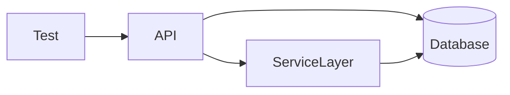

# Lesson 1: Integration Testing Concepts (Long-form Enhanced)

> Integration tests validate boundaries where many real bugs live: request parsing + validation, middleware + handlers, ORM + constraints. This lesson focuses on deterministic, CI-friendly integration testing.

## Table of Contents

- What integration tests are (and where they sit)
- High-value boundaries (API↔DB, service↔repo)
- Deterministic setup/teardown patterns
- Avoiding environment drift (CI vs local)
- Best practices, pitfalls, troubleshooting
- Advanced patterns (preview): dockerized dependencies, contract mocks, parallelization strategy

## Learning Objectives

By the end of this lesson, you will be able to:
- Explain what integration tests are and how they differ from unit/E2E tests
- Identify valuable integration boundaries in a full-stack app (API↔DB, service↔service)
- Design integration tests that are deterministic and CI-friendly
- Structure setup/teardown to avoid shared-state flakiness
- Recognize common pitfalls (slow suites, environment drift, relying on real third-party services)

## Why Integration Tests Matter

Unit tests validate isolated logic, but many bugs happen at boundaries:
- request parsing + validation
- ORM queries + constraints
- authentication middleware + handlers

Integration tests validate that multiple components work together correctly.



## What is Integration Testing?

Integration testing verifies behavior across two or more components.
It sits between:
- **unit tests** (fast, isolated)
- **E2E tests** (slow, full workflow)

Integration tests are often the “highest ROI” tests for backend correctness.

## Integration Test Types (Common Boundaries)

- **API + Database**: test endpoints with a real test DB
- **Service integration**: test service layer + repositories
- **External services**: test integration with third-party APIs (usually via sandbox or contract mocks)

### What not to do by default

Avoid hitting real third-party APIs in CI:
- flaky
- slow
- rate limited
- can cost money

Prefer:
- test doubles
- local mocks
- contract tests (advanced)

## Test Setup Pattern (Hooks)

```typescript
describe("User API Integration", () => {
  beforeAll(async () => {
    // Setup test database (migrate, connect, seed baseline if needed)
    await setupTestDatabase();
  });

  afterAll(async () => {
    // Cleanup (disconnect clients, stop servers)
    await cleanupTestDatabase();
  });

  beforeEach(async () => {
    // Reset state (truncate tables, reseed)
    await resetDatabase();
  });
});
```

### Why `beforeEach` reset matters

Integration tests must not depend on:
- execution order
- leftover rows from previous tests

Resetting state keeps tests deterministic.

## Determinism and Speed (The Trade-off)

Integration tests are slower than unit tests.
To keep them valuable:
- test the highest-risk boundaries
- keep the suite small but meaningful
- avoid unnecessary setup per test

## Real-World Scenario: Auth + DB Bug

A classic integration failure:
- auth middleware sets `req.user`
- handler assumes `req.user.id`
- DB query fails if user doesn’t exist or session parsing is wrong

Unit tests might miss this; integration tests catch it.

## Best Practices

### 1) Use a dedicated test environment

Use a test DB (`TEST_DATABASE_URL`) and never share with dev/prod.

### 2) Keep tests independent

Reset state and avoid shared mutable fixtures.

### 3) Make failure output actionable

When an integration test fails, the message should tell you what contract broke.

## Common Pitfalls and Solutions

### Pitfall 1: Flaky tests due to shared state

**Problem:** tests pass/fail depending on run order.

**Solution:** reset DB state in `beforeEach`.

### Pitfall 2: Slow CI

**Problem:** integration tests dominate pipeline time.

**Solution:** run unit tests on every PR; run integration tests on main or in parallel jobs.

### Pitfall 3: Environment drift

**Problem:** tests pass locally but fail in CI due to different DB versions/env.

**Solution:** run test dependencies via Docker in CI and pin versions.

## Troubleshooting

### Issue: Integration tests hang or never exit

**Symptoms:**
- Jest doesn’t exit

**Solutions:**
1. Close DB connections in `afterAll`.
2. Ensure servers are stopped.
3. Avoid leaving timers or open handles.

## Advanced Patterns (Preview)

### 1) Dockerized dependencies in CI

Running Postgres/Redis in CI via Docker improves consistency and prevents “works locally” drift.

### 2) Contract mocks for third-party APIs (concept)

Instead of calling real third-party APIs, use contract-style mocks that enforce expected request/response shapes.

### 3) Parallelization strategy

Common approach:
- run unit tests on every PR (fast)
- run integration tests in parallel jobs (or on main) to keep feedback fast without skipping coverage

## Next Steps

Now that you understand integration test goals:

1. ✅ **Practice**: Identify 3 app boundaries worth integration testing
2. ✅ **Experiment**: Run integration tests against a dockerized Postgres in CI
3. 📖 **Next Lesson**: Learn about [Test Databases](./lesson-02-test-databases.md)
4. 💻 **Complete Exercises**: Work through [Exercises 05](./exercises-05.md)

## Additional Resources

- [Kent C. Dodds: Mostly integration tests](https://kentcdodds.com/blog/write-tests)

---

**Key Takeaways:**
- Integration tests validate boundaries (API↔DB, middleware↔handlers) where many bugs occur.
- Keep them deterministic with clean state per test.
- Avoid real third-party dependencies in CI by default.
