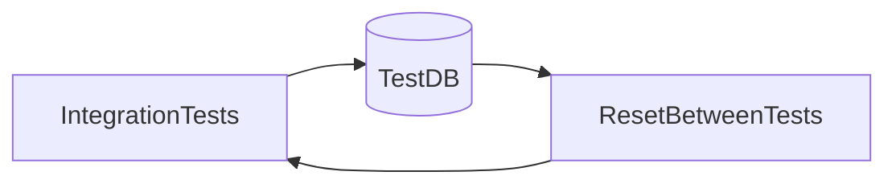

# Lesson 2: Test Databases (Long-form Enhanced)

> Database-backed tests are only trustworthy when DB state is isolated and deterministic. This lesson focuses on using `TEST_DATABASE_URL`, choosing a reset strategy, and keeping tests fast enough for CI.

## Table of Contents

- Separate test database (safety first)
- Deterministic seeding (fixtures)
- Reset strategies (deleteMany vs truncate vs rebuild)
- Transaction rollback (concept)
- Best practices, pitfalls, troubleshooting
- Advanced patterns (preview): fail-fast guards, test containers, per-suite migrations

## Learning Objectives

By the end of this lesson, you will be able to:
- Configure a separate database for integration tests (`TEST_DATABASE_URL`)
- Seed deterministic test data for reliable assertions
- Choose a reset strategy (truncate, deleteMany, schema reset) and understand trade-offs
- Understand transaction-based isolation (and when it does/doesn’t work)
- Avoid common pitfalls (testing against dev/prod, slow cleanup, FK constraint failures)

## Why Test Databases Matter

Integration tests that hit the database are only trustworthy if the database state is:
- isolated
- deterministic
- fast to reset

Otherwise, tests become flaky and slow, and teams stop trusting them.



## Separate Test Database

Use a different database for tests:

```typescript
import { PrismaClient } from "@prisma/client";

const testPrisma = new PrismaClient({
  datasources: {
    db: {
      url: process.env.TEST_DATABASE_URL,
    },
  },
});
```

### Safety guard (recommended)

In real projects, add a guard that fails fast if `TEST_DATABASE_URL` is missing or looks like production.

## Database Seeding (Deterministic Fixtures)

Seed only what you need and keep it predictable:

```typescript
async function seedTestData() {
  await testPrisma.user.createMany({
    data: [
      { email: "user1@test.com", name: "User 1" },
      { email: "user2@test.com", name: "User 2" },
    ],
  });
}
```

### Seeding tips

- use obvious emails/IDs so failures are readable
- seed minimal data per test unless you need a shared baseline

## Reset Strategies (Pick One)

Common approaches:

- **Delete per table** (`deleteMany`): simplest, can be slow and FK-order sensitive
- **Truncate**: fast, but DB-specific and needs care with FKs
- **Recreate schema** per run: clean and deterministic, can be slow

The “best” strategy depends on:
- database size
- number of tests
- CI runtime constraints

## Transaction Rollback (Isolation Technique)

Conceptually:
- start a transaction
- run test inside
- roll back afterwards

```typescript
test("creates user", async () => {
  await testPrisma.$transaction(async (tx) => {
    const user = await tx.user.create({ data: { email: "test@test.com" } });
    expect(user).toBeDefined();
    // Transaction rollback depends on how the transaction is managed.
  });
});
```

### Important caveat

Not all transaction patterns automatically roll back unless you explicitly control it.
Also, if your code under test opens its own DB connection, it may not participate in the same transaction.

For many apps, deterministic cleanup + seeding is simpler and more reliable.

## Real-World Scenario: Integration Tests for Auth

Auth integration tests often require:
- users in DB
- hashed passwords
- sessions/tokens

A consistent seed/reset strategy prevents “works locally” test drift.

## Best Practices

### 1) Make test DB disposable

Never store anything important in the test DB.

### 2) Keep data deterministic

Avoid random IDs/values unless you explicitly assert patterns.

### 3) Reset state between tests

Order-independent tests are non-negotiable at scale.

## Common Pitfalls and Solutions

### Pitfall 1: FK constraint failures during cleanup

**Problem:** deleting parent rows first fails.

**Solution:** delete children before parents, or use truncation with cascade strategies.

### Pitfall 2: Slow seeding

**Problem:** seeding too much data per test.

**Solution:** seed minimal fixtures and reuse baseline seeding when safe.

### Pitfall 3: Tests point at the wrong DB

**Problem:** environment variables misconfigured in CI.

**Solution:** enforce `TEST_DATABASE_URL` and add fail-fast guards.

## Troubleshooting

### Issue: Tests are flaky due to leftover data

**Symptoms:**
- tests fail depending on order

**Solutions:**
1. Ensure reset happens in `beforeEach`.
2. Ensure resets cover all tables that can be modified.

## Advanced Patterns (Preview)

### 1) Fail-fast guards for safety

Fail early if `TEST_DATABASE_URL` is missing or suspicious (looks like prod). This prevents catastrophic mistakes.

### 2) Test containers (concept)

Spinning up a fresh Postgres container per CI job increases isolation and reproducibility.

### 3) Migration discipline in tests

In CI, apply migrations to the test DB before running tests so you validate the real schema evolution path.

## Next Steps

Now that you understand test databases:

1. ✅ **Practice**: Choose and implement one reset strategy consistently
2. ✅ **Experiment**: Create minimal seed helpers for common fixtures
3. 📖 **Next Lesson**: Learn about [API Integration](./lesson-03-api-integration.md)
4. 💻 **Complete Exercises**: Work through [Exercises 05](./exercises-05.md)

## Additional Resources

- [PostgreSQL: TRUNCATE](https://www.postgresql.org/docs/current/sql-truncate.html)
- [Prisma: Testing](https://www.prisma.io/docs/guides/testing)

---

**Key Takeaways:**
- Integration tests need isolated, deterministic database state.
- Use a dedicated test DB and reset state between tests.
- Choose a reset strategy intentionally and keep seeding minimal and predictable.
