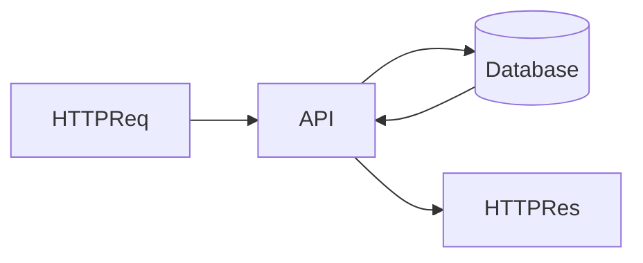

# Lesson 3: API Integration (Long-form Enhanced)

> API integration tests validate the full path: request → validation/auth → DB writes → response contract. This lesson focuses on combining Supertest with direct DB assertions without making tests brittle.

## Table of Contents

- What API integration tests validate
- Happy paths + error paths (validation/auth/not-found)
- Deterministic resets and minimal fixtures
- Strong assertions (contract + DB state)
- Best practices, pitfalls, troubleshooting
- Advanced patterns (preview): seeding helpers, test factories, contract enforcement

## Learning Objectives

By the end of this lesson, you will be able to:
- Write integration tests that validate full request → DB → response behavior
- Combine Supertest requests with direct DB assertions for strong confidence
- Test both success flows and error flows (validation/auth/not-found)
- Keep integration tests deterministic (reset state, avoid shared data)
- Avoid common pitfalls (asserting too much, relying on test order, leaking DB connections)

## Why API Integration Tests Matter

API integration tests validate your system at a realistic boundary:
- client sends HTTP request
- app parses/validates/auths
- app reads/writes database
- app returns a stable response contract

They catch bugs that unit tests and mocked DB tests can miss.



## Full Stack Integration (Happy Path)

```typescript
test("complete user flow", async () => {
  // 1) Create user via API
  const createResponse = await request(app)
    .post("/users")
    .send({ email: "test@test.com", name: "Test" })
    .expect(201);

  const userId = createResponse.body.user.id;

  // 2) Verify in database
  const user = await prisma.user.findUnique({ where: { id: userId } });
  expect(user).toBeDefined();

  // 3) Fetch via API
  const getResponse = await request(app).get(`/users/${userId}`).expect(200);

  expect(getResponse.body.user.email).toBe("test@test.com");
});
```

### What makes this “integration”

This test validates:
- route wiring
- body parsing + validation
- ORM behavior and constraints
- response formatting

## Testing Error Flows (Validation)

```typescript
test("handles validation errors", async () => {
  const response = await request(app)
    .post("/users")
    .send({ email: "invalid-email" })
    .expect(400);

  expect(response.body.error).toBeDefined();
});
```

### Expand error coverage

High-value additional error flows:
- missing fields (400)
- unauthenticated access (401)
- unauthorized access (403)
- not found (404)

## Determinism: Reset State

Integration tests must be order-independent.

Common pattern:
- `beforeEach` truncates tables (or deletes in FK-safe order)
- seed minimal baseline data per test

## Real-World Scenario: Regression in Error Responses

If you change error response shape:
- frontend error handling can break

Integration tests that assert on error shape prevent subtle client regressions.

## Best Practices

### 1) Assert the contract, not everything

Assert what matters:
- status codes
- required JSON fields
- key DB side effects

Avoid brittle assertions on timestamps and auto-generated IDs.

### 2) Keep tests fast

Only write integration tests where they add unique value.

### 3) Prefer “one behavior per test”

Large tests are hard to debug. Keep the story short and focused.

## Common Pitfalls and Solutions

### Pitfall 1: Tests depend on shared DB state

**Problem:** flakiness and order dependence.

**Solution:** reset DB per test and seed minimal fixtures.

### Pitfall 2: Slow suites

**Problem:** too many integration tests for trivial logic.

**Solution:** keep most logic unit-tested; reserve integration tests for boundaries.

### Pitfall 3: Connection leaks

**Problem:** Jest hangs and doesn’t exit.

**Solution:** disconnect Prisma and stop servers in `afterAll`.

## Troubleshooting

### Issue: Integration tests fail in CI only

**Symptoms:**
- timeouts, connection errors, missing env vars

**Solutions:**
1. Ensure CI starts required services (Postgres) and sets `TEST_DATABASE_URL`.
2. Ensure migrations run before tests.
3. Ensure cleanup/reset doesn’t rely on test ordering.

## Advanced Patterns (Preview)

### 1) Small factories for fixtures

Create helpers like `createUser()` that return ids and only seed what the test needs. This keeps tests readable and independent.

### 2) Contract enforcement

Write tests that enforce the API contract:
- stable success shape
- stable error shape
So clients don’t break silently when backend changes.

### 3) Keep “assertions per test” focused

Integration tests should assert a few high-signal facts:
- response code + shape
- key DB rows created/updated
Avoid asserting every field unless it’s important and deterministic.

## Next Steps

Now that you can write API integration tests:

1. ✅ **Practice**: Add tests for 401/403/404 flows
2. ✅ **Experiment**: Add migration + seed steps to CI before running tests
3. 📖 **Next Level**: Move into E2E testing with Playwright
4. 💻 **Complete Exercises**: Work through [Exercises 05](./exercises-05.md)

## Additional Resources

- [Supertest](https://github.com/ladjs/supertest)
- [Prisma: Testing](https://www.prisma.io/docs/guides/testing)

---

**Key Takeaways:**
- API integration tests validate request → DB → response behavior.
- Keep tests deterministic with reset/seed patterns.
- Cover both happy paths and error paths that clients rely on.
