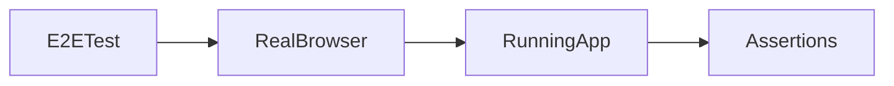

# Lesson 1: Playwright Setup (Long-form Enhanced)

> Playwright gives you high-confidence E2E coverage by running real browsers. This lesson focuses on reproducible setup (local + CI), stable locators, and debugging tools like traces.

## Table of Contents

- What E2E tests are (and when they’re worth it)
- Installing Playwright reproducibly
- Configuring `playwright.config.ts` (local + CI)
- Writing a first stable test (locators + expects)
- Debugging failures (trace/screenshot/video)
- Best practices, pitfalls, troubleshooting
- Advanced patterns (preview): auth setup, test isolation, webServer strategy

## Learning Objectives

By the end of this lesson, you will be able to:
- Explain what E2E testing is and when Playwright is a good fit
- Install Playwright and browsers in a reproducible way
- Configure Playwright (`playwright.config.ts`) for local and CI runs
- Run your first Playwright test and interpret failures (trace/screenshots)
- Avoid common pitfalls (flaky waits, hardcoded selectors, relying on real external services)

## Why Playwright Matters

Playwright runs a real browser and tests user workflows end-to-end:
- clicks and typing
- navigation
- network requests
- rendering and accessibility

E2E tests are slower than unit/integration tests, but they provide the highest confidence for critical flows.



## Installation

```bash
pnpm add -D @playwright/test@^1.58.0
npx playwright install
```

### Why `playwright install` exists

It downloads the browser binaries Playwright uses (Chromium/WebKit/Firefox).
This keeps tests consistent across machines and CI.

## Configuration

Create `playwright.config.ts`:

```typescript
import { defineConfig } from "@playwright/test";

export default defineConfig({
  testDir: "./e2e",
  use: {
    baseURL: "http://localhost:3000",
  },
  webServer: {
    command: "pnpm dev",
    url: "http://localhost:3000",
  },
});
```

### Key options explained

- `testDir`: where your E2E tests live
- `baseURL`: lets you use relative paths in tests (`page.goto("/")`)
- `webServer`: starts your app automatically before tests and waits for readiness

## First Test

```typescript
import { test, expect } from "@playwright/test";

test("homepage loads", async ({ page }) => {
  await page.goto("/");
  await expect(page).toHaveTitle(/Next\.js/);
});
```

### Make first tests stable

Prefer:
- `getByRole` locators (accessible + stable)
- waiting via `expect(...)` (auto-retries) instead of manual sleeps

## Debugging Failures (What to Use)

When E2E fails, you often want:
- screenshot
- trace
- video (optional)

Playwright supports these features to help you diagnose failures quickly.

## Real-World Scenario: “Login Works” Regression

Login is a critical flow.
An E2E test can catch:
- broken auth redirects
- API errors not surfaced in UI
- broken cookies/session configuration

## Best Practices

### 1) Keep E2E tests for critical flows

Don’t E2E-test every tiny component; use unit/component tests for that.

### 2) Use stable locators

Prefer:
- role + accessible name
- labels
over brittle CSS selectors.

### 3) Control external dependencies

Mock or sandbox external services to avoid flakiness and cost.

## Common Pitfalls and Solutions

### Pitfall 1: Using fixed sleeps

**Problem:** `waitForTimeout(1000)` creates flaky tests.

**Solution:** wait on expectations (`toHaveURL`, `toBeVisible`) and network conditions intentionally.

### Pitfall 2: Brittle selectors

**Problem:** `.some-class > div:nth-child(3)` breaks on redesigns.

**Solution:** use semantic locators (`getByRole`, `getByLabelText`).

### Pitfall 3: Running E2E against the wrong environment

**Problem:** tests hit production/staging unintentionally.

**Solution:** use explicit config and environment variables for baseURL.

## Troubleshooting

### Issue: Web server never becomes “ready”

**Symptoms:**
- Playwright times out waiting for URL

**Solutions:**
1. Confirm `pnpm dev` starts correctly locally.
2. Ensure the app listens on the expected port.
3. Increase timeout only after confirming the server start command is correct.

## Advanced Patterns (Preview)

### 1) Auth setup (reuse login)

For many suites, logging in through the UI for every test is slow. Playwright supports storage state patterns to reuse authenticated sessions (advanced).

### 2) Isolation and deterministic data

E2E tests should create their own data or reset state between runs—avoid relying on “seeded prod-like data” that can drift.

### 3) Web server strategy in CI

In CI you may run:
- one server per job
- or one shared server for the suite
Choose the approach that matches your pipeline constraints and isolation needs.

## Next Steps

Now that you can set up Playwright:

1. ✅ **Practice**: Add a second test that checks a key UI element by role
2. ✅ **Experiment**: Enable traces on failures and inspect them
3. 📖 **Next Lesson**: Learn about [E2E Scenarios](./lesson-02-e2e-scenarios.md)
4. 💻 **Complete Exercises**: Work through [Exercises 06](./exercises-06.md)

## Additional Resources

- [Playwright Docs](https://playwright.dev/docs/intro)

---

**Key Takeaways:**
- Playwright runs real browsers for high-confidence E2E testing.
- Configure `webServer` and `baseURL` for stable local/CI runs.
- Avoid flaky sleeps; use stable locators and expectation-based waiting.
