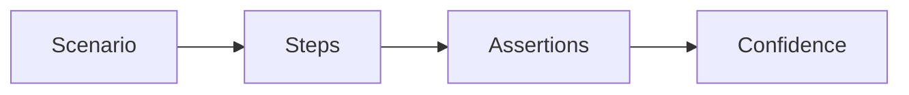

# Lesson 2: E2E Scenarios (Long-form Enhanced)

> E2E tests are expensive, so scenario design matters. This lesson focuses on choosing high-value workflows, using stable locators, and waiting correctly to avoid flaky tests.

## Table of Contents

- Choosing high-value scenarios (small set, high confidence)
- Stable interactions (locators + navigation)
- Strong assertions (user-visible outcomes)
- Waiting correctly (conditions over sleeps)
- Best practices, pitfalls, troubleshooting
- Advanced patterns (preview): data setup, auth shortcuts, reducing suite time

## Learning Objectives

By the end of this lesson, you will be able to:
- Design E2E scenarios that reflect real user workflows
- Write stable interactions (navigation, form filling, clicking)
- Use strong assertions (URL, visibility, content) without brittle selectors
- Wait correctly (avoid sleeps; wait on UI conditions and navigation)
- Avoid common pitfalls (flaky selectors, race conditions, relying on seeded prod data)

## Why Scenario Design Matters

E2E tests are expensive, so they should cover:
- high-value workflows (login, checkout, CRUD flows)
- regressions that matter to users

You want a small number of scenarios that catch the biggest failures.



## User Interactions (Example: Login)

```typescript
test("user can login", async ({ page }) => {
  await page.goto("/login");
  await page.fill('input[name="email"]', "user@example.com");
  await page.fill('input[name="password"]', "password");
  await page.click('button[type="submit"]');

  await expect(page).toHaveURL("/dashboard");
});
```

### Make interactions resilient

Prefer locators that reflect accessibility:
- roles (`getByRole`)
- labels (`getByLabelText`)

This makes tests survive CSS/layout changes.

## Assertions (What to Verify)

Common high-signal assertions:

```typescript
// Text content
await expect(page.locator("h1")).toHaveText("Welcome");

// Visibility
await expect(page.locator(".modal")).toBeVisible();

// URL
await expect(page).toHaveURL("/dashboard");
```

### Assert user-visible outcomes

Avoid asserting internal implementation details. Confirm:
- the user landed on the right screen
- the UI shows expected content
- error messages appear when appropriate

## Waiting (Avoid Flakiness)

Prefer waiting on conditions over time.

```typescript
// Wait for element to disappear (loading finished)
await page.waitForSelector(".loading", { state: "hidden" });

// Wait for navigation
await page.waitForURL("/dashboard");

// Wait for a network response (when needed)
await page.waitForResponse((response) => response.url().includes("/api"));
```

### Guiding principle

Wait for the thing the user would perceive:
- a spinner disappears
- a button becomes enabled
- a success message appears

## Real-World Scenario: Signup → Login → Create Item

Good E2E flows often:
- create a fresh user (or use a known test account)
- login
- create a resource
- verify it appears in the UI

This validates the system end-to-end without needing internal hooks.

## Best Practices

### 1) Keep scenarios independent

Scenarios shouldn’t depend on each other’s order or data.

### 2) Use stable test data

Create test users/resources per test (or per suite) and clean up if needed.

### 3) Minimize scope

Each E2E test should validate one critical workflow, not the whole app.

## Common Pitfalls and Solutions

### Pitfall 1: Flaky selectors

**Problem:** CSS changes break tests.

**Solution:** use semantic locators and accessibility-first selectors.

### Pitfall 2: Race conditions

**Problem:** assertion runs before UI update.

**Solution:** wait on `expect(...)` or explicit UI states; avoid fixed sleeps.

### Pitfall 3: Reliance on shared seeded data

**Problem:** tests fail when environment data changes.

**Solution:** create required data as part of the test setup.

## Troubleshooting

### Issue: Tests fail intermittently due to timing

**Symptoms:**
- sporadic failures on navigation or visibility checks

**Solutions:**
1. Replace `waitForTimeout` sleeps with condition waits.
2. Assert on stable UI milestones (URL, success toast, visible heading).
3. Reduce test coupling (independent data per test).

## Advanced Patterns (Preview)

### 1) Deterministic data setup

Create data per test (or per describe block) so scenarios don’t depend on global seeded state.

### 2) Auth shortcuts (storage state)

Reuse authenticated sessions to reduce test time and flakiness when login is not the behavior under test.

### 3) Keep suite runtime intentional

Most teams keep E2E suites small:
- a few critical flows on every PR
- broader coverage on main/nightly

## Next Steps

Now that you can write stable scenarios:

1. ✅ **Practice**: Write a login scenario using role/label locators
2. ✅ **Experiment**: Add an error-path scenario (invalid password shows error)
3. 📖 **Next Lesson**: Learn about [Testing Workflows](./lesson-03-testing-workflows.md)
4. 💻 **Complete Exercises**: Work through [Exercises 06](./exercises-06.md)

## Additional Resources

- [Playwright: Locators](https://playwright.dev/docs/locators)

---

**Key Takeaways:**
- E2E scenarios should focus on high-value user workflows.
- Use semantic locators and condition-based waiting to avoid flakiness.
- Keep scenarios independent with deterministic test data.
