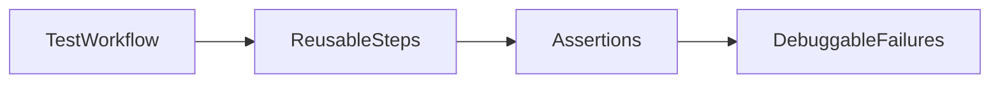

# Lesson 3: Testing Workflows (Long-form Enhanced)

> Workflows keep E2E suites maintainable as they grow. This lesson focuses on making flows readable, reducing duplication with helpers/POM where it helps, and keeping tests debuggable in CI.

## Table of Contents

- Designing readable workflows (avoid mega-tests)
- Stable assertions and debuggability
- Page Object Model (when it helps vs hurts)
- Helpers/fixtures (auth, setup, teardown)
- Best practices, pitfalls, troubleshooting
- Advanced patterns (preview): test fixtures, trace-first debugging, parallel safety

## Learning Objectives

By the end of this lesson, you will be able to:
- Build complete E2E workflows that are readable and maintainable
- Structure E2E tests to reduce flakiness and improve debugging
- Use the Page Object Model (POM) appropriately (and avoid overusing it)
- Add workflow-level setup/teardown (auth helpers, fixtures)
- Avoid common pitfalls (mega-tests, hidden dependencies, duplicated steps)

## Why Workflow Design Matters

As E2E suites grow, your biggest risks become:
- duplicated steps everywhere
- unreadable tests
- brittle flows that are hard to debug

Workflow design keeps tests:
- consistent
- maintainable
- easier to fix when the UI changes



## Complete User Flows

```typescript
test('complete registration flow', async ({ page }) => {
  // 1. Navigate to registration
  await page.goto('/register');
  
  // 2. Fill form
  await page.fill('input[name="name"]', 'Alice');
  await page.fill('input[name="email"]', 'alice@example.com');
  await page.fill('input[name="password"]', 'password123');
  
  // 3. Submit
  await page.click('button[type="submit"]');
  
  // 4. Verify redirect
  await expect(page).toHaveURL('/dashboard');
  
  // 5. Verify user is logged in
  await expect(page.locator('.user-name')).toHaveText('Alice');
});
```

### Make workflows stable

Prefer stable assertions:
- URL changes (`toHaveURL`)
- visible headings (`getByRole('heading', ...)`)
- user-facing messages

Avoid asserting on brittle classes like `.user-name` unless you control them as test hooks.

## Page Object Model (POM)

```typescript
class LoginPage {
  constructor(private page: Page) {}
  
  async goto() {
    await this.page.goto('/login');
  }
  
  async login(email: string, password: string) {
    await this.page.fill('input[name="email"]', email);
    await this.page.fill('input[name="password"]', password);
    await this.page.click('button[type="submit"]');
  }
}
```

### When POM helps

Use POM when:
- a page is used across many tests
- selectors are repeated
- you want a clean abstraction for “user actions”

### When POM hurts

Avoid turning your tests into a second app:
- too much abstraction hides intent
- debugging becomes harder

## Shared Helpers (A Practical Alternative)

Sometimes a small helper is enough:
- `loginAs(page, user)`
- `createPost(page, data)`

Prefer simple helpers over heavy OOP patterns unless needed.

## Real-World Scenario: Authenticated Workflow Tests

Most apps have flows like:
- register/login
- create/update/delete a resource
- logout and verify access removed

Design these as independent workflows and keep setup explicit.

## Best Practices

### 1) Keep E2E tests short and focused

One critical workflow per test is a good baseline.

### 2) Make setup explicit

If a test needs a logged-in user, do it clearly (UI login or auth helper).

### 3) Collect good diagnostics

Enable traces/screenshots on failure so “failed in CI” is actionable.

## Common Pitfalls and Solutions

### Pitfall 1: Mega-tests

**Problem:** one test covers everything; failures are hard to debug.

**Solution:** split workflows into smaller, focused scenarios.

### Pitfall 2: Hidden dependencies

**Problem:** a test assumes data exists or a previous test ran.

**Solution:** create data as part of setup and keep tests independent.

### Pitfall 3: Duplicated selectors

**Problem:** UI change breaks dozens of tests.

**Solution:** use POM/helpers to centralize selectors where it adds value.

## Troubleshooting

### Issue: Tests pass locally but fail in CI

**Symptoms:**
- timing-related failures, missing data, different baseURL

**Solutions:**
1. Use condition-based waiting and stable assertions.
2. Ensure baseURL/webServer config matches CI.
3. Use deterministic test data creation.

## Advanced Patterns (Preview)

### 1) Trace-first debugging

Prefer traces/screenshots on failure so CI failures are actionable without rerunning locally.

### 2) Fixtures for shared setup

Playwright fixtures can centralize setup (like creating a logged-in page) without hiding test intent.

### 3) Parallel safety

If tests run in parallel, avoid:
- shared users/emails
- shared mutable DB state without isolation
- reliance on global ordering

## Next Steps

Now that you can build maintainable workflows:

1. ✅ **Practice**: Introduce a small helper or POM for a frequently tested page
2. ✅ **Experiment**: Split one long flow into 2–3 focused E2E tests
3. 📖 **Next**: You’ve completed the testing course lessons—move into caching and error tracking
4. 💻 **Complete Exercises**: Work through [Exercises 06](./exercises-06.md)

## Additional Resources

- [Playwright: Test fixtures](https://playwright.dev/docs/test-fixtures)

---

**Key Takeaways:**
- Workflow design keeps E2E suites maintainable as they grow.
- Use POM/helpers only where they reduce duplication without hiding intent.
- Keep tests independent, focused, and well-instrumented for CI debugging.
